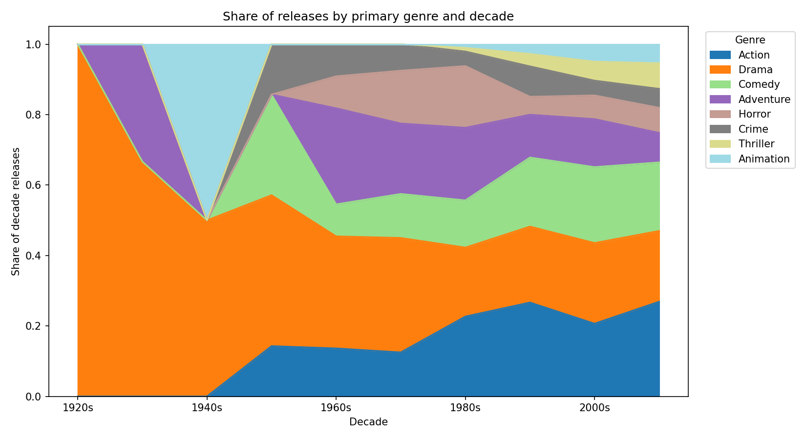
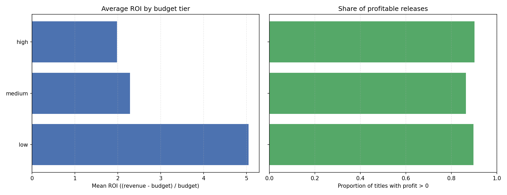

# Team Findings Report

## Key Findings

* Smaller budgets deliver the most efficient returns, but large-scale productions capture the biggest absolute gains

## Genre Analysis

* **Action dominates the 21st century**: In the 2010s, Action accounted for nearly 27% of all releases, overtaking Drama and Comedy as the leading genre by volume.

* **Comedy has shown steady resilience**: Comedy consistently holds between 18–22% of releases since the 1960s, making it one of the most stable genres over time.

* **Adventure and Thriller genres grew in modern eras**: Adventure and Thriller expanded noticeably from the 1980s onward, reflecting blockbuster and franchise-driven production trends.

## Financial Analysis

* **Low-budget films lead in ROI**: Despite smaller budgets (≈ $9 M on average), low-budget releases achieve a mean ROI of 5.0×, more than double the return of medium or high-budget productions.

* **Profitability is high across all tiers**: Roughly 87–90 % of movies in every budget category are profitable, showing consistent success rates regardless of scale.

* **Trade-off between efficiency and scale**: Smaller productions maximize percentage returns, while blockbusters dominate total dollars earned.

## Modeling

_TBD: Summarize top features influencing ratings._
